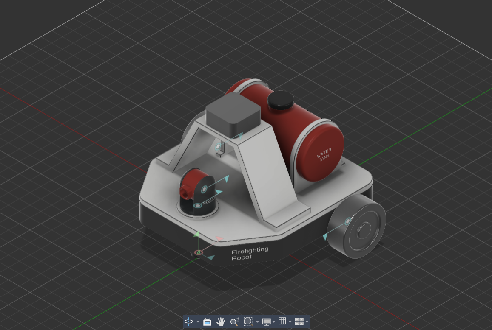
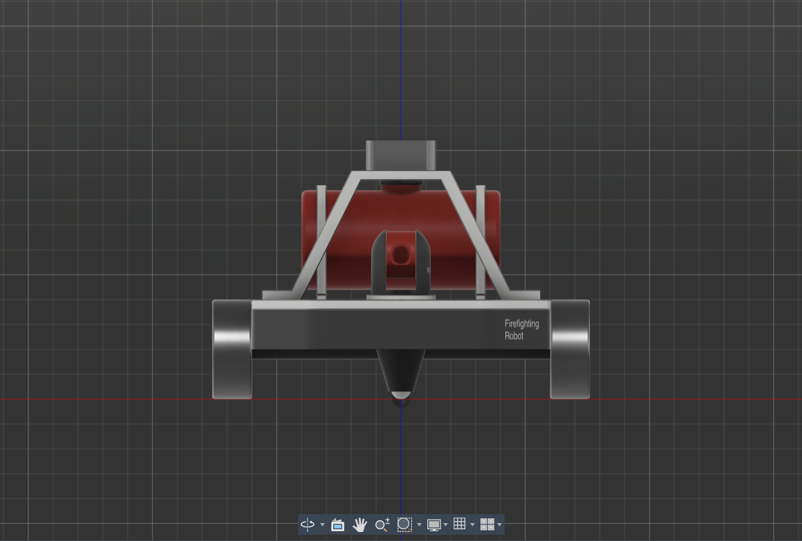
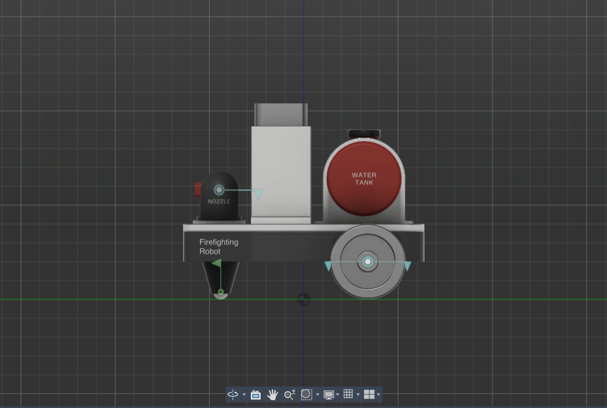
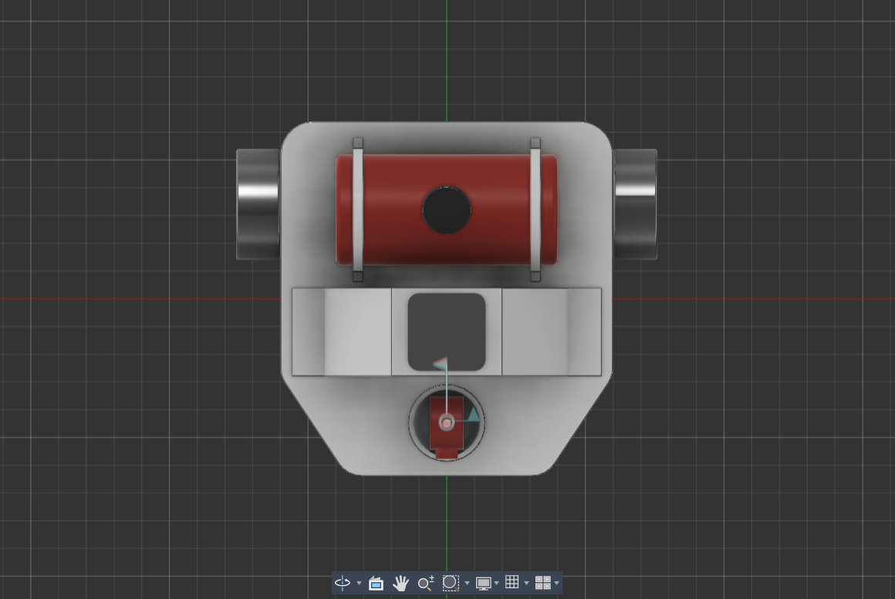
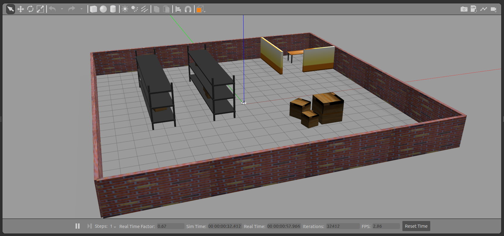
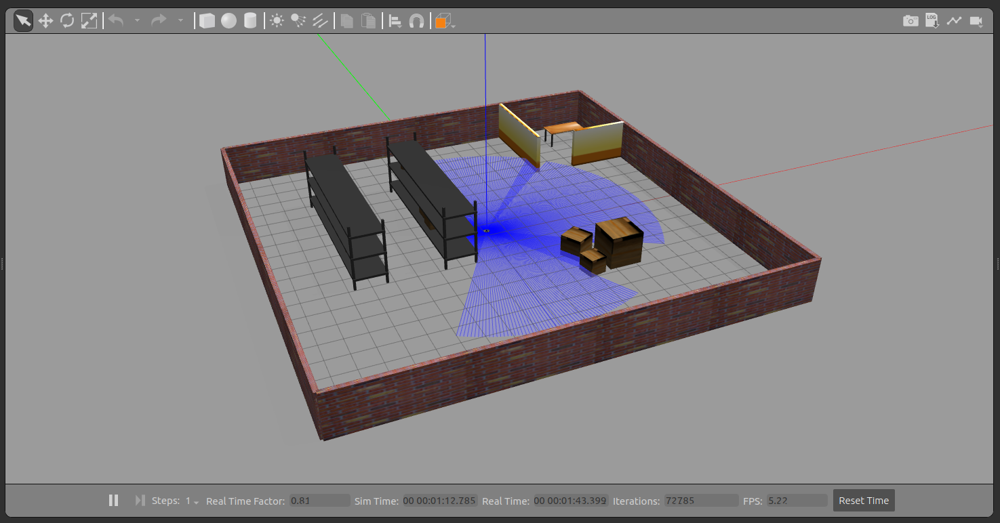
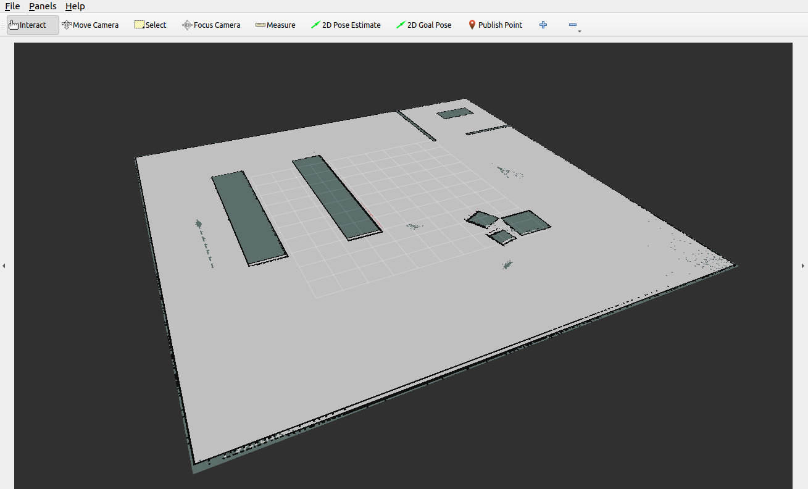

# 🚒 Firefighting Robot ROS 2

<p align="center">
  
</p>

This repository contains the ROS 2 (Humble) package for the autonomous firefighting robot simulation. The robot's initial design was created in Fusion 360, exported via the `fusion2urdf` script, and fully adapted to run natively in ROS 2. 

It features a custom differential drive system, joint state publishers for the directional nozzle, and a full simulated warehouse environment using Gazebo.

---

## 🛠 Features

* **ROS 2 Humble Support:** Entirely migrated from legacy ROS 1 `catkin` macros to modern `ament_cmake`.
* **Gazebo Integration:** The robot drives successfully within Gazebo using `libgazebo_ros_diff_drive.so`.
* **RViz 2 Visualization:** View the `RobotModel`, TF trees, and joint movements correctly synchronized using the `/robot_description` topic.
* **Custom Environment:** A custom `warehouse.world` environment built from scratch featuring walls and boxes for obstacle avoidance testing.
* **Teleop Ready:** Fully compatible with standard `teleop_twist_keyboard` to manually drive the robot and aim the firefighting nozzle.

---

## 🚀 Installation & Setup

1. **Clone the repository:**
   Clone this package directly into the `src` folder of your ROS 2 workspace.
   ```bash
   cd ~/ros2_ws/src
   git clone https://github.com/arin-goyal/firefighting-robot-ros2.git
   ```

2. **Install Dependencies:**
   Ensure you have the required ROS 2 Gazebo and RViz packages.
   ```bash
   sudo apt update
   sudo apt install ros-humble-gazebo-ros-pkgs ros-humble-joint-state-publisher-gui ros-humble-xacro
   ```

3. **Build the Workspace:**
   ```bash
   cd ~/ros2_ws
   colcon build --packages-select final_assembly_description
   source install/setup.bash
   ```

---

## 🎮 Usage

### 1. View in RViz (Visualization Only)
Launch the robot inside RViz and use the Joint State Publisher GUI sliders to test the wheels and the nozzle mechanism.
```bash
ros2 launch final_assembly_description display.launch.py
```

### 2. Launch in Gazebo (Physics Simulation)
Spawn the robot into the custom warehouse world in Gazebo.
```bash
ros2 launch final_assembly_description gazebo.launch.py
```
*(Note: If Gazebo crashes inside a Virtual Machine due to OpenGL limitations, run `export LIBGL_ALWAYS_SOFTWARE=1` in the terminal before launching).*

### 3. Teleoperation
Open a new terminal, source your workspace, and run the teleop node to drive the robot around the warehouse!
```bash
ros2 run teleop_twist_keyboard teleop_twist_keyboard
```

---

## ✨ Completed Features
- [x] **3D CAD to URDF conversion** with precise inertia and collision meshes.
  <p align="center">
    
    
    
  </p>
- [x] **Gazebo Simulation Environment** with a custom warehouse and physics plugins.
  <p align="center">
    
  </p>
- [x] **Custom PID Controller (Python)** for autonomous forward driving to a target and nozzle aiming.
- [x] **2D LiDAR integration** for standard SLAM mapping (`slam_toolbox`).
  <p align="center">
    
    <br/><br/>
    
  </p>

## 🚀 Running the Project

### 1. Launching the Simulation
```bash
export LIBGL_ALWAYS_SOFTWARE=1
ros2 launch final_assembly_description gazebo.launch.py
```

### 2. Autonomous PID Controller
```bash
ros2 run firefighting_robot_control pid_controller
```
*(The robot will autonomously drive straight for 2.0 meters while smoothly tilting the nozzle upwards by 0.5 radians).*

### 3. SLAM (Mapping the Warehouse)
Launch SLAM Toolbox (Make sure to use Simulation Time!):
```bash
ros2 launch slam_toolbox online_async_launch.py use_sim_time:=true
```
Launch RViz to see the map generating in real-time:
```bash
export MESA_GL_VERSION_OVERRIDE=3.3
export MESA_GLSL_VERSION_OVERRIDE=330
ros2 run rviz2 rviz2 --ros-args -p use_sim_time:=true
```
*(Note: Change the Map Color Scheme to `costmap` in RViz to prevent VirtualBox OpenGL crashes).*

Save the final map:
```bash
ros2 run nav2_map_server map_saver_cli -f ~/warehouse_map
```

## 🔮 Future Work
- **Fully Autonomous Path Planning**: Integrating the `Nav2` stack for dynamic obstacle avoidance and autonomous navigation to specific coordinates.
- **Fire Extinguishing Simulation**: Developing a custom Gazebo plugin or ROS 2 node to visually and physically simulate spraying water and lowering the temperature of a simulated fire source.

---
*Developed by Arin Goyal*
